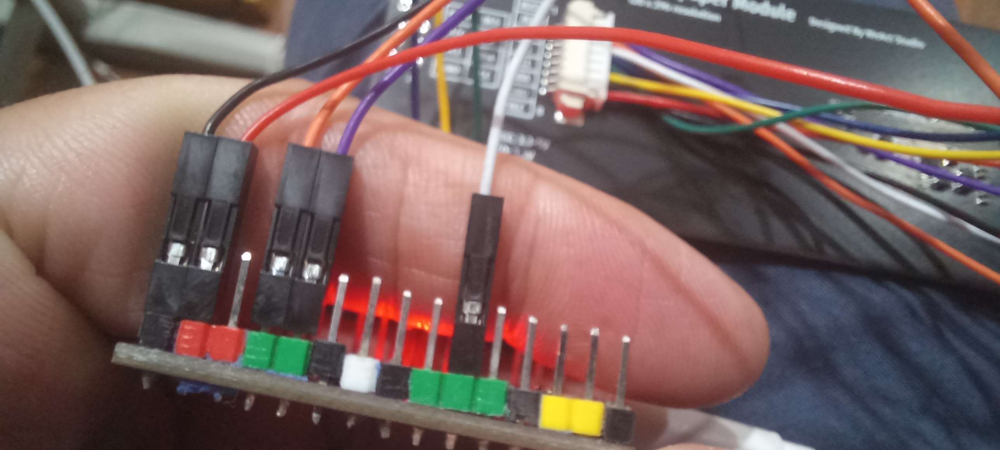
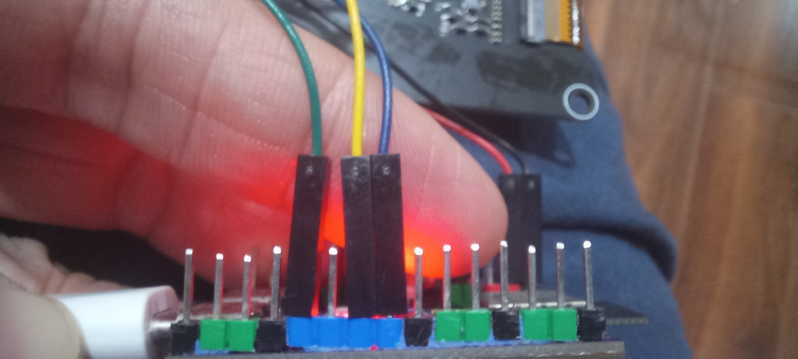

# WeAct Studio Epaper Module

## Tested

- Sample code: (just comment the variable of 213" and uncomment the one of 290_BS. Compiling immediately) <https://github.com/WeActStudio/WeActStudio.EpaperModule>
- Wires:
  
  
  VCC=3.3V
- Dependencies: GxPD2 of Jean-Marc Zingg, ver 1.5.2
- Board: Esp32-C3 DevKitM-1
- EPD: WeAct 2.9" Black/White
- 

## EPD Board

