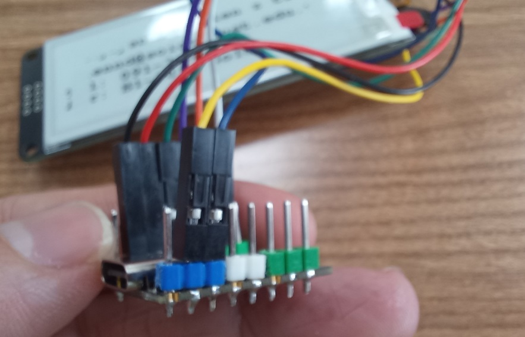

# WeAct Studio Epaper Module

## Tested Esp32-C3 DevKitM-1

- Hardware Specification

```plain
- VCC=3.3V
- Dependencies: GxPD2 of Jean-Marc Zingg, ver 1.5.2
- Board: Esp32-C3 DevKitM-1 Dual Usb
- EPD: WeAct 2.9" Black/White
```

- Sample code: (just comment the variable of 213" and uncomment the one of 290_BS. Compiling immediately) <https://github.com/WeActStudio/WeActStudio.EpaperModule>

must define board and type of ePD

```C
#define ESP32_C3_DUALUSB
//#define COLORED   
```

- Wires:

  
  
- [](https://youtu.be/yVmRT403PUM)

## Tested Esp32-C3 Super Mini

- Sample code: must uncomment

```C
#define ESP32_C3_SUPERMINI
#define COLORED
```

and comment other boards

- Wires:

  
  
  
  
  
  
  
  VCC=3.3V
- Dependencies: GxPD2 of Jean-Marc Zingg, ver 1.5.2
- Board: [Esp32-C3 Super Mini](https://vi.aliexpress.com/i/1005005319963906.html?gatewayAdapt=glo2vnm)
- EPD: WeAct 2.9" Black/White
- [](https://youtu.be/yVmRT403PUM)

## Some functions

1. setRotation(angle)

```C
  display.setRotation(0); //0=0* | 1=90* | 2 = 180 * | 3 = 270*
```

  

## EPD Board


